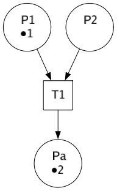

# Petri Net Simulator
Petri Net simulator library written in Go.
This implementation uses goroutines and channels to handle concurrency in the net.


Simple Petri Net intro can be found at https://www.techfak.uni-bielefeld.de/~mchen/BioPNML/Intro/pnfaq.html

## Usage example

### Import simulator library
```go
import (
	"github.com/fsantagostinobietti/petri-net-simulator/petrinet"
)
```

### Build Net
```go
net := petrinet.NewNet("MyNet")

p1 := net.NewPlace("P1") 
p2 := net.NewPlace("P2") 
t1 := net.NewTransition("T1")
const w1 = 1
p1.ConnectTo(t1, w1)   // P1 -> T1
const w2 = 1
p2.ConnectTo(t1, w2)   // P2 -> T1
pa := net.NewPlace("Pa")
const wa = 1
t1.ConnectTo(pa, wa)   // T1 -> Pa

// define an alert function to inform me simulation is over
pa.SetAlertFunc(func(pi petrinet.PlaceI) bool {
	return pi.Tokens() >= 2*wa
})
```

### Run Petri Net
```go
// init net with tokens
p1.AddTokens(3 * w1)
p2.AddTokens(1 * w2)

// start simulation
net.EnableAnimation(true)
net.Start()

// tokens can be added also during simulation
p2.AddTokens(1 * w2)

// wait for the alert event to rise
pa.WaitForAlert()

// ... stop simulation
net.Stop()
```
### Save Net status as diagram image
```go
net.SavePng("mynet.png")
```




### Save Net animation as Gif
```go
net.SaveAnimationAsGif("mynet.gif")
```


